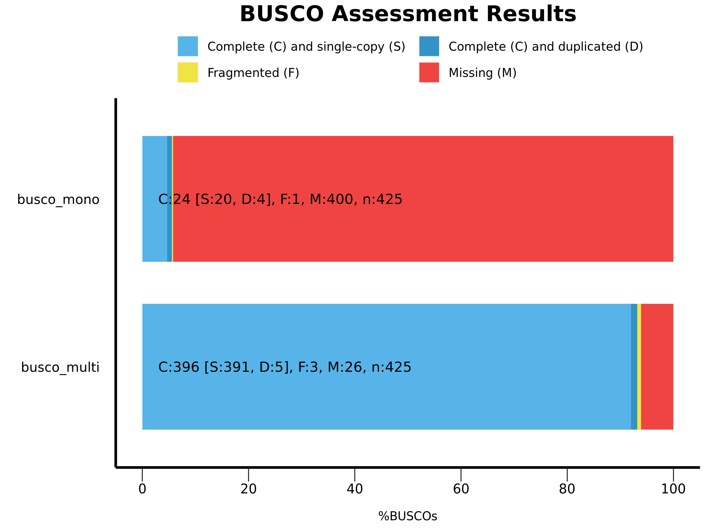
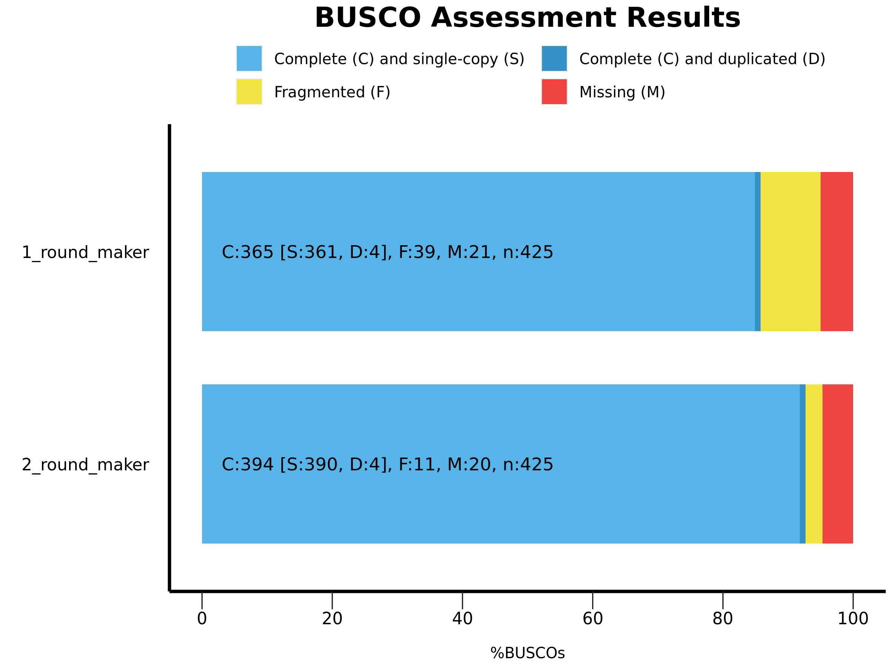
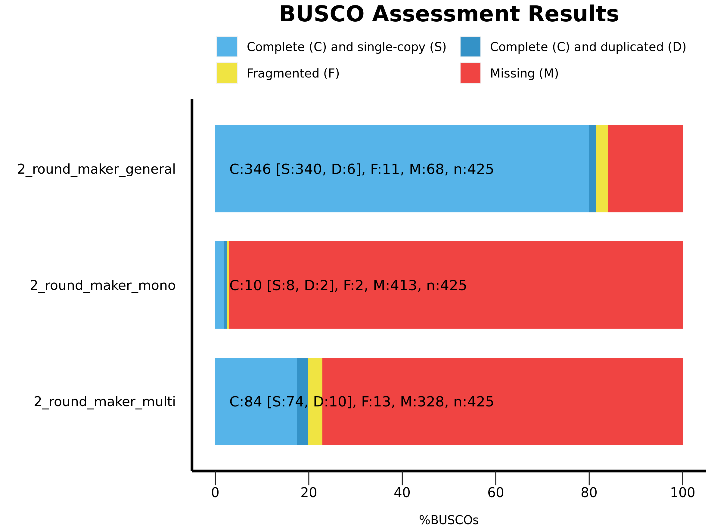
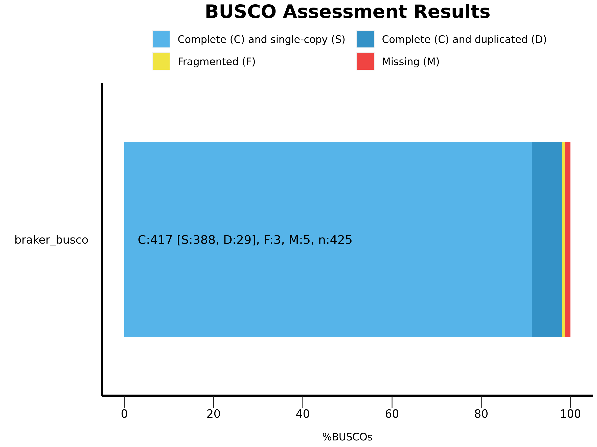
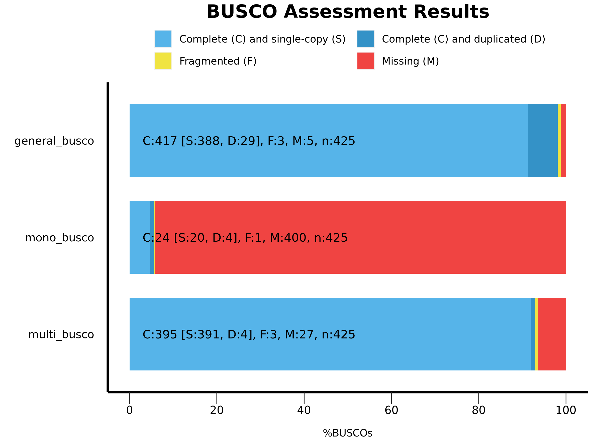

# Structural Annotation 

This repository is a usable, publicly available differential expression and functional annotation tutorial.
All steps have been provided for the UConn CBC Xanadu cluster here with appropriate headers for the Slurm scheduler that can be modified simply to run.  Commands should never be executed on the submit nodes of any HPC machine.  If working on the Xanadu cluster, you should use sbatch scriptname after modifying the script for each stage.  Basic editing of all scripts can be performed on the server with tools, such as nano, vim, or emacs.  If you are new to Linux, please use <a href="https://bioinformatics.uconn.edu/unix-basics/">this</a> handy guide for the operating system commands.  In this guide, you will be working with common bioinformatic file formats, such as <a href="https://en.wikipedia.org/wiki/FASTA_format">FASTA</a>, <a href="https://en.wikipedia.org/wiki/FASTQ_format">FASTQ</a>, <a href="https://en.wikipedia.org/wiki/SAM_(file_format)">SAM/BAM</a>, and <a href="https://en.wikipedia.org/wiki/General_feature_format">GFF3/GTF</a>. You can learn even more about each file format <a href="https://bioinformatics.uconn.edu/resources-and-events/tutorials/file-formats-tutorial/">here</a>. If you do not have a Xanadu account and are an affiliate of UConn/UCHC, please apply for one <a href="https://bioinformatics.uconn.edu/contact-us/">here</a>.  


Contents
1.   [Overview](#1-overview)
2.   [Downloading Data](#2-downloading-the-data)
3.   [Quality control of reads](#3-quality-control-of-reads)
4.   [Identifying Regions of Genomic Repetition with RepeatModeler](#4-identifying-regions-of-genomic-repetition-with-repeatmodeler)
5.   [Masking Regions of Genomic Repetition with RepeatMasker](#5-masking-regions-of-genomic-repetition-with-repeatmasker)
6.   [Mapping RNA-Seq reads with HISAT2](#6-mapping-rna-seq-reads-with-hisat2) 
7.   [Aligning short reads](#7-aligning-short-reads)  
8.   [BRAKER2: identifying and predicting genes with RNA-Seq data](#8-braker2-identifying-and-predicting-genes-with-rna-seq-data)  
9.   [gFACs](#9-gfacs)  
10.  [Functional annotation using EnTap](#10-functional-annotation-using-entap) 
11.  [Gene prediction using maker](#11-gene-prediction-using-maker)
12.  [gFACs](#12-gfacs)  
13.  [Functional annotation using EnTap](#13-functional-annotation-using-entap)   

Long Read Annotation   
14.   [Long read data download](#14-long-read-data-download)   
15.   [Aligning reads using minimap2](#15-aligning-the-reads-to-genome-using-minimap2)   
16.   [Braker](#16-braker)   
17.   [gFACs](#17-gfacs)   
18.   [Functional annotation using EnTap](#18-functional-annotation-using-entap)  
19.   [GFFCompare](#19-gffcompare)    
20.   [Orthofinder](#20-orthofinder)  


## 1.  Overview
In this tutorial we will be performing functional and structural annotation of Arabidopsis thaliana using data of its leaves at 4 weeks of age.  
The workflow may be cloned into the appropriate directory using the terminal command: 
```
git clone repository.git
```

## 2. Downloading the data
Besides our RNA-Seq reads, the only other data required for our annotation is the Arabidopsis thaliana reference genome (this does not include the databases installed with the various software used in this tutorial). While the reference genome may be found on the NCBI website, we will be using the un-annotated genome located on Xanadu.

Now, we must download our RNA-Seq using the SRA-toolkit. We will be running this command as a slurm scheduler script. For more information, please visit the link provided. 

It is important to know the layout of your SRA reads. For us, we are using paired-end reads. In future steps, we will want to be able to have two files, right-hand and left-hand, for each read which we can instruct our software to treat as paired. However, the SRA reads are compiled into a single file! To subvert this, we use the "--split-files" option of the sratoolkit to save each read in two separate files corresponding to the left-hand and right-hand reads. In here we will be accessing RNA seq data from WT Arabidopsis thaliana leaves, where total number of reads per library will be around 20M-22M, which is in acceptable range for RNA Seq and for annotation (around 15M).

```
module load sratoolkit

fastq-dump --split-files SRR6852085
fastq-dump --split-files SRR6852086
```

The complete slurm script can be found in the 01_raw_data folder called [sra_download.sh](01_raw_data/sra_download.sh).

Once the data is downloaded the folder will have the following files:
```
01_raw_data/
├── SRR6852085_1.fastq
├── SRR6852085_2.fastq
├── SRR6852086_1.fastq
└── SRR6852086_2.fastq
```
You can check the number of reads in a fastq file using the following awk command:
```
awk '{s++}END{print s/4}' SRR6852085_1.fastq
```
As each fastq file contains 4 lines per each read, you will need to divide the total number of counts you get, by that number, which will give you the number of reads in the sample.  


## 3. Quality control of reads  

### Quality check of the reads using FASTQC   
In here we will use the FASTQC package to check the quality of the reads.   
```
mkdir -p raw_fastqc_out
fastqc --threads 2 -o ./raw_fastqc_out ../01_raw_data/*.fastq 
```  
complete slurm script [02a_raw_fastqc.sh](02_qc/02a_raw_fastqc.sh).
FASTQC report information for SRR6852085_1.fastq can be found [here](FASTQC.md).

We also want to trim our files to only take high-quality reads. We use the program sickle to trim our files. For information on sickle and its options, you may visit the paired-end reference section of the github provided prior. 

```
module load sickle/1.33

sickle pe \
        -t sanger \
        -f ../01_raw_data/SRR6852085_1.fastq -r ../01_raw_data/SRR6852085_2.fastq \
        -o trimmed_SRR6852085_1.fastq -p trimmed_SRR6852085_2.fastq -s trimmed_singles_6852085.fastq \
        -q 30 -l 50


sickle pe \
        -t sanger \
        -f ../01_raw_data/SRR6852086_1.fastq -r ../01_raw_data/SRR6852086_2.fastq \
        -o trimmed_SRR6852086_1.fastq -p trimmed_SRR6852086_2.fastq -s trimmed_singles_6852086.fastq \
        -q 30 -l 50
```

The complete slurm script is called [sickle_trimming.sh](02_qc/sickle_trimming.sh).

The options for paired-end reads we use:
```
Usage: sickle  [options]
Command:
pe	paired-end sequence trimming

Options:
Paired-end separated reads
--------------------------
-f, --pe-file1, Input paired-end forward fastq file (Input files must have same number of records)
-r, --pe-file2, Input paired-end reverse fastq file
-o, --output-pe1, Output trimmed forward fastq file
-p, --output-pe2, Output trimmed reverse fastq file. Must use -s option.
```

This will result in trimmed reads:
```
02_qc/
├── trimmed_singles_6852085.fastq
├── trimmed_singles_6852086.fastq
├── trimmed_SRR6852085_1.fastq
├── trimmed_SRR6852085_2.fastq
├── trimmed_SRR6852086_1.fastq
└── trimmed_SRR6852086_2.fastq
```

## 4. Identifying Regions of Genomic Repetition with RepeatModeler
A significant proportion of any eukaryotic genome is low complexity regions, often consisting of [repetitive elements](https://en.wikipedia.org/wiki/Repeated_sequence_(DNA)). Marking the presence of these repeats is an important part of structural annotation of genomic sequence. A good fraction of these repeats are associated with Transposable elements (TE) also known as mobile elements. TE are biologically important as they are proposed to have role in [genome evolution](https://pubmed.ncbi.nlm.nih.gov/15016989/) , [genomic rearrangement](https://pubmed.ncbi.nlm.nih.gov/15020798/) and modulation of gene expression. On the flip side, repeats can negatively affect the alignment when present flanking a genomic-region of interest. As part of genome annotation process we have to identify and annotate these repeats in our genome.  As these repeats can negatively affect gene predictions and evolutionary studies it demands that we mask them.  The masking of a sequence in genome is of 2 types, 

(1) **Hard-Masking** where the the sequence is replaced by Ns.  Example the repeat sequence TGCAAATCGCA (terminal inverted repeat sequence  of Class 2 TE's) is hard masked in the sequence below

`CTGTGCAAATCGCAGTTA -> CTGNNNNNNNNNNNGTTA `

(2) **Soft-masking** , this involves converting the sequence from Uppercase to lowercase as an examle the same repeat sequence is soft masked below

`CTGTGCAAATCGCAGTTA -> CTGtgcaaatcgcagTTA `

It is fairly obvious that hard masking or removal of repeats is loss of sequence information as compared to soft masking and hence later is the preferred mode of masking a genome in an annotation process. The masking is a 2 fold process, one identification of repeats and secondly masking them.
Software used in identification of repeats can be categorised as extrensic and intrinsic tools.

**Extrinsic tools**, e.g. [RepeatMasker](https://www.repeatmasker.org/), uses the repeat sequence (from a closely related species) listed in Repbase (a repeat database) and annotate there presence in our assembled genome.

**Intrinsic tool**, e.g. [RepeatModeler](http://www.repeatmasker.org/RepeatModeler/), perform a de novo identification and modelling of TE families. 

### RepeatModeler
It relies on three de-novo repeat finding programs ( RECON, RepeatScout and LTRHarvest/LTR_retriever ) which employ complementary computational methods for identifying repeat element boundaries and family relationships from sequence data. A brief description each of the programme is given below

**RECON** can carry out denovo identification and classification of repeat sequence families. In order to achieve that it first perform pairwise alignment between the genomic sequences and then it cluster the sequences using single linkage cluster (agglomerative clustering) approach. It then uses the multiple alignment information to define boundaries of repeats and also to distinguish homologous but distinct repeat element families.

**RepeatScout** first create a frequency table of l-mers (l=ceil(log_4(L)+1), where L length of input sequence) then it creates a fasta file of all the repetitive elements. It then run 2 rounds of filtering on the repeat elements ("filter-stage-1.prl" and "filter-stage-2.prl"), in the first round it removes low complexity tandem repeats from the fasta file following that the frequency of repeats in fasta fasta file is estimated in the genome using RepeatMasker. In second round of filtering, repeats appearing less than certain number of times (default 10) are removed.

**LTRHarvest/LTR_retriever** perform de novo detection of full length LTR retrotransposons in large sequence sets. LTRharvest efficiently delivers high quality annotations based on known LTR transposon features like length, distance, and sequence motifs. LTR_retriever carry out accurate identification of LTR retrotransposons (LTR-RTs) from output of LTRharvest and generates non-redundant LTR-RT library for genome annotations.

Typically both Intrinsic and Extrinsic tools are used to annotate and mask the repaets of a genome and thats what we will be doing here. We will perform Repeatmodeller first to identify novel motifs and then using RepeatMasker we will softmask repeats in the genome using sequences of novel repeats and reference repeats (from Repbase).  Before we identify our repeat regions, we must first compile our database using the "BuildDatabase" command of RepeatModeler. This will format the FASTA files for use with RepeatModeler.
```
module load RepeatModeler/2.01
BuildDatabase -name "athaliana_db"  Athaliana_167_TAIR9.fa
```
Command options:
```
BuildDatabase [-options] -name "mydb" <seqfile(s) in fasta format>
-name <database name>  The name of the database to create.
```
The complete slurm script called [03a_create_db.sh](03_repeatmodeler/03a_create_db.sh) can be found in `03_repeatmodeler/` directory.
This will create the following database files:
```
├── athaliana_db.nhr
├── athaliana_db.nin
├── athaliana_db.nnd
├── athaliana_db.nni
├── athaliana_db.nog
├── athaliana_db.nsq
├── athaliana_db.translation
```
It is not important that you understand what each file represents. However, if you are interested in varying that all of your choromosomes were compiled, you may view the .translation file. It should look like:
```
Chr1    1
Chr2    2
Chr3    3
Chr4    4
Chr5    5
ChrM    6
ChrC    7
```
We see that all seven chromosomes were succesffuly compiled! We are now ready to run the RepeatModeler.
```
module load RepeatModeler/2.01
RepeatModeler -pa 30 -database athaliana_db -LTRStruct
```
Options:
```
RepeatModeler [-options] -database <XDF Database>
-pa          Specify the number of parallel search jobs to run.
-LTRStruct   Run the LTR structural discovery pipeline
-database    The name of the sequence database to run an analysis on
```
This process may run for over a day, so be patient and do not submit the job more than once! After completion of the run, there should be a directory called RM*. Let's have a look at its contents:
```
RM_150489.*/
├── consensi.fa
├── consensi.fa.classified
├── round-1
├── round-2
├── round-3
├── round-4
├── round-5
```
Per the RepeatModeler [webpage](http://www.repeatmasker.org/RepeatModeler/), we see each file as:
```
          round-1/
               sampleDB-#.fa       : The genomic sample used in this round
               sampleDB-#.fa.lfreq : The RepeatScout lmer table
               sampleDB-#.fa.rscons: The RepeatScout generated consensi
               sampleDB-#.fa.rscons.filtered : The simple repeat/low
                                               complexity filtered
                                               version of *.rscons
               consensi.fa         : The final consensi db for this round
               family-#-cons.html  : A visualization of the model
                                     refinement process.  This can be opened
                                     in web browsers that support zooming.
                                     ( such as firefox ).
                                     This is used to track down problems
                                     with the Refiner.pl
               index.html          : A HTML index to all the family-#-cons.html
                                     files.
          round-2/
               sampleDB-#.fa       : The genomic sample used in this round
               msps.out            : The output of the sample all-vs-all
                                     comparison
               summary/            : The RECON output directory
                    eles           : The RECON family output
               consensi.fa         : Same as above
               family-#-cons.html  : Same as above
               index.html          : Same as above
          round-3/
               Same as round-2
           ..
          round-n/
```
We see that we have information about the genomic sample used in each round, a consensus seqeuence frequency matrix for the genomic sample, the generated predicted consensus sequences, and visualizations. This format is repeated for various rounds with summaries of all rounds compiled in the summary directories. Our complete, predicted consensus sequences may be found in the various "consensi" fastas. Now that we have generated our consensus sequences, we are ready to mask our genome using the RepeatMasker.  


## 5. Masking Regions of Genomic Repetition with RepeatMasker
Now that we have identified our consensus sequences, we are ready to mask them using the RepeatMasker. RepeatMasker requires two arguments, a library of repetitive regions for your organism and the genome fasta for your organism. RepeatMasker will align the repetitive regions to your genome followed by masking those repetitive regions within your genome appropriately. Let's have a look at the RepeatMasker options:
```
RepeatMasker
::small preview of options::
   -lib
        Rather than use a database, use your own RepeatModeler consensus fasta to ammend your genome
   -small
       Returns complete .masked sequence in lower case
   -xsmall
       Returns repetitive regions in lowercase (rest capitals) rather than
       masked
   -x  Returns repetitive regions masked with Xs rather than Ns
```
We want to softmask only repetitive regions, so we will be using the option "xsmall". Notice that in our athaliana.fa file, the headers contain spaces. For future reference, that is asking for software errors in the future. Let's truncate our headers and remove the whitespaces. We can do that with the sed command:
```
sed -i 's/Chr1.*/Chr1/g; s/Chr2.*/Chr2/g; s/Chr3.*/Chr3/g; s/Chr4.*4/Chr4/g; s/Chr5.*/Chr5/g; s/ChrM.*/ChrM/g; s/ChrC.*/ChrC/g;' athaliana.fa
```
The -i option commands sed to edit the file in its place, requiring no new file, while 's/Chr1.*/Chr1/g;' commands sed to replace all lines which begin with Chr1 with simply Chr1. We simply stack our replacement set within the quotes, separated by semi-colons. And voila! We are now ready to run RepeatMasker.
```
RepeatMasker -pa 8 -lib ../03_repeatmodeler/RM_150489.WedMar311224002021/consensi.fa -gff -a -noisy -xsmall Athaliana_167_TAIR9.fa
```
The complete slurm script is called [04a_repeatmasker.sh](04_repeatmasker/04a_repeatmasker.sh).
This will produce the following files:
```
04_repeatmasker
├── Athaliana_167_TAIR9.fa.align
├── Athaliana_167_TAIR9.fa.cat.gz
├── Athaliana_167_TAIR9.fa.log
├── Athaliana_167_TAIR9.fa.masked
├── Athaliana_167_TAIR9.fa.masked.idx
├── Athaliana_167_TAIR9.fa.ori.out
├── Athaliana_167_TAIR9.fa.out
├── Athaliana_167_TAIR9.fa.out.gff
└── Athaliana_167_TAIR9.fa.tbl
```
We are mainly interested in the masked fasta, let's give it a quick look on `Athaliana_167_TAIR9.fa.masked`, which shows the genome is soft-masked.
```
>less  Athaliana_167_TAIR9.fa.masked
>Chr1
ccctaaaccctaaaccctaaaccctaaacctctgaatccttaatccctaa
atccctaaatctttaaatcctacatccatgaatccctaaatacctaattc
cctaaacccgaaaccGGTTTCTCTGGTTGAAAATCATTGTGTATATAATG
ATAATTTTATCGTTTTTATGTAATTGCTTATTGTTGTGTGTAGATTTTTT
AAAAATATCATTTGAGGTCAATACAAATCCTATTTCTTGTGGTTTTCTTT
CCTTCACTTAGCTATGGATGGTTTATCTTCATTTGTTATATTGGATACAA
GCTTTGCTACGATCTACATTTGGGAATGTGAGTCTCTTATTGTAACCTTA
GGGTTGGTTTATCTCAAGAATCTTATTAATTGTTTGGACTGTTTATGTTT
GGACATTTATTGTCATTCTTACTCCTTTGTGGAAATGTTTGTTCTATCAA
```
RepeatMasker produces masking stats and other relevant output files, lets have a look at few of them.

**Athaliana_167_TAIR9.fa.tbl** have summary stats showing % of genome masked and the repeat elements that were used in the masking and there individual contribution in masking.
```
>head -12 Athaliana_167_TAIR9.fa.tbl
==================================================
file name: Athaliana_167_TAIR9.fa
sequences:             7
total length:  119667750 bp  (119482146 bp excl N/X-runs)
GC level:         36.06 %
bases masked:   21209318 bp ( 17.72 %)
==================================================
               number of      length   percentage
               elements*    occupied  of sequence
--------------------------------------------------
SINEs:                0            0 bp    0.00 %
      ALUs            0            0 bp    0.00 %
```
**Athaliana_167_TAIR9.fa.out** This file provide some details on each individual masking by providing SW (Smith-Waterman) scores, percent divergence, deletion, insertion, genomic location and repeat type. SW and divergence score cutoff can bet set while running RepeatMasker.
```
 SW   perc perc perc  query     position in query              matching           repeat            position in repeat
 score   div. del. ins.  sequence  begin    end          (left)   repeat             class/family  begin   end    (left)     ID
   349   13.6  5.2  4.3  Chr1             1      115 (30427556) C rnd-1_family-2     Unspecified    (1084)    286     171     1
    21    2.9  5.7  0.0  Chr1          1064     1098 (30426573) + (CACCCCC)n         Simple_repeat       1     37     (0)     2 *
    22   10.0  0.0  0.0  Chr1          1066     1097 (30426574) + (C)n               Simple_repeat       1     32     (0)     3
    15   17.1  0.0  0.0  Chr1          1155     1187 (30426484) + (TTTCTT)n          Simple_repeat       1     33     (0)     4
    28    8.4  0.0  0.0  Chr1          4291     4328 (30423343) + (AT)n              Simple_repeat       1     38     (0)     5
    16    9.3  0.0  0.0  Chr1          5680     5702 (30421969) + (T)n               Simple_repeat       1     23     (0)     6
    36    0.0  0.0  0.0  Chr1          8669     8699 (30418972) + (CT)n              Simple_repeat       1     31     (0)     7
```
***Athaliana_167_TAIR9.fa.out.gff** provides the masking information in a gff format. The columns are , chromosome, software used to annotate the feature (here RepeatMaasker), Feature type, Start and End of feature, Score, Strand and last column shows additional attributes assosiated with the feature.
```
##gff-version 2
##date 2021-07-27
##sequence-region Athaliana_167_TAIR9.fa
Chr1    RepeatMasker    similarity      1       115     13.6    -       .       Target "Motif:rnd-1_family-2" 171 286
Chr1    RepeatMasker    similarity      1064    1098     2.9    +       .       Target "Motif:(CACCCCC)n" 1 37
Chr1    RepeatMasker    similarity      1066    1097    10.0    +       .       Target "Motif:(C)n" 1 32
Chr1    RepeatMasker    similarity      1155    1187    17.1    +       .       Target "Motif:(TTTCTT)n" 1 33
Chr1    RepeatMasker    similarity      4291    4328     8.4    +       .       Target "Motif:(AT)n" 1 38
Chr1    RepeatMasker    similarity      5680    5702     9.3    +       .       Target "Motif:(T)n" 1 23
Chr1    RepeatMasker    similarity      8669    8699     0.0    +       .       Target "Motif:(CT)n" 1 31
```
**Athaliana_167_TAIR9.fa.align** shows the alignment of repeat to the genomic sequence.
```
349 13.63 5.17 4.35 Chr1 1 115 (30427556) C rnd-1_family-2#Unspecified (1084) 286 171 m_b1s001i0 1
  Chr1                   1 CCCTAAACCCTAAACCCTAAACCCTAAACCTCTGAATCCTTAATCCCTAA 50
                                                         -  i  ii     -
C rnd-1_family-        286 CCCTAAACCCTAAACCCTAAACCCTAAACC-CTAAACTCTTAA-CCCTAA 239
  Chr1                  51 ATCCCTAAATC-TTTAAATCCTACATCCATGAATCCCTAAAT-----ACC 94
                            -       i -ii    i    v i  - i  -       ?-----
C rnd-1_family-        238 A-CCCTAAACCGCCTAAACCCTAAACCC-TAAA-CCCTAAANCCTAAACC 192
  Chr1                  95 TAATTCCCTAAACCCGAAACC 115
                           i  vv          v
C rnd-1_family-        191 CAAAACCCTAAACCCTAAACC 171
Matrix = 20p35g.matrix
Kimura (with divCpGMod) = 14.34
Transitions / transversions = 2.50 (10/4)
Gap_init rate = 0.06 (7 / 114), avg. gap size = 1.57 (11 / 7)
21 2.94 5.71 0.00 Chr1 1064 1098 (30426573) (CACCCCC)n#Simple_repeat 1 37 (0) m_b1s252i0 2
  Chr1                1064 CACCCCCCACCTCCC-CCCCCC-CCCCCCACCCCCCA 1098
                                      i   -      -
  (CACCCCC)n#Si          1 CACCCCCCACCCCCCACCCCCCACCCCCCACCCCCCA 37
Matrix = Unknown
Transitions / transversions = 1.00 (1/0)
Gap_init rate = 0.06 (2 / 34), avg. gap size = 1.00 (2 / 2)
```

### Evaluating using BUSCO  
In here we will evalute the assemblies using BUSCO.  
```
busco -i Athaliana_167_TAIR9.fa.masked \
        -o masked_genome \
        -c 8 \
        -l /isg/shared/databases/BUSCO/odb10/lineages/viridiplantae_odb10 -m genome
```  

**NOTE**: When running busco you need to copy the augustus config directory to a location which you have the permision to write to and the path to the augustus config directory should be exported beforehand.  

General useage of the command: 
```
usage: busco -i [SEQUENCE_FILE] -l [LINEAGE] -o [OUTPUT_NAME] -m [MODE] [OTHER OPTIONS] 
``` 

The command options we will be using: 
```
-i FASTA FILE   Input sequence file in FASTA format
-l LINEAGE      Specify the name of the BUSCO lineage
-o OUTPUT       Output folders and files will be labelled with this name
-m MODE         BUSCO analysis mode
					- geno or genome, for genome assemblies (DNA)
					- tran or transcriptome, for transcriptome assemblies (DNA)
					- prot or proteins, for annotated gene sets (protein)
```
The complete BUSCO scrip is called [04b_busco.sh](04_repeatmasker/04b_busco.sh).  

In here the busco metrics proposed to describe genome/gene-set/transcriptome completeness used the the following notation: 
Where recovered genes are marked as complete (C), and complete genes found with more than one copy is depected as duplicate (D), and complete single copy genes as single-copy (S) genes. The partial recovered genes are named as fragmented (F) and the genes which could not be found is named as missing (M) genes.  
So the following notation is used in busco notation:  
C: Complete, D: duplicated, F: fragmented, M: missing, n: number of genes used.   

Summary of the inital assembly assesment using BUSCO:  
```
        --------------------------------------------------
        |Results from dataset viridiplantae_odb10         |
        --------------------------------------------------
        |C:99.3%[S:98.6%,D:0.7%],F:0.0%,M:0.7%,n:425      |
        |422    Complete BUSCOs (C)                       |
        |419    Complete and single-copy BUSCOs (S)       |
        |3      Complete and duplicated BUSCOs (D)        |
        |0      Fragmented BUSCOs (F)                     |
        |3      Missing BUSCOs (M)                        |
        |425    Total BUSCO groups searched               |
        --------------------------------------------------
```   


## 6. Mapping RNA-Seq reads with HISAT2
_**Purpose of mapping RNAseq reads.**_

_We will be using **BRAKER** workflow for gene prediction in our genome. [BRAKER](https://www.ncbi.nlm.nih.gov/pmc/articles/PMC6635606/) works on two tools GeneMark-ES/ET and AUGUSTUS. AUGUSTUS has large number of parameters that are species specific, hence a training step for parameter optimization is required.  In order to estimate optimal parameters for AUGUSTUS, it must be trained on expert curated set of gene structures as part of supervised learning. The curated gene structure may not be available for all the species and it could hinder use of AUGUSTUS. On the other hand GeneMark-ES/ET can generate these parameters by unsupervised trainning but presence of external evidence of Exon-intron boundries (like RNAseq data) can greatly enhance its performance. In essence GeneMark-ES/ET is trained (using extrinsic data like RNAseq) and predicts a first gene set. This gene set is filtered. AUGUSTUS is trained on the filtered gene set for parameter optimisation. In order to use the RNAseq data we have to map it to assembled genome and the resulting alignment file will be used in downstream BRAKER pipeleine_

We will now be mapping our RNA-Seq reads to the masked genome using HISAT2. Before aligning our reads, we need to build an index of our masked genome.

```
module load hisat2/2.2.1

hisat2-build -p 8 ../04_repeatmasker/Athaliana_167_TAIR9.fa.masked Athaliana_masked
```

hisat2-build command:
```
 Usage: hisat2-build [options]
reference_in       comma-separated list of files with ref sequences
hisat2_index_base  write ht2 data to files with this dir/basename
```
The complete slurm script is called [05_hisat2_index.sh](05_hisat2_index/05_hisat2_index.sh). This will create the following files:
```
05_hisat2_index/
├── Athaliana_masked.1.ht2
├── Athaliana_masked.2.ht2
├── Athaliana_masked.3.ht2
├── Athaliana_masked.4.ht2
├── Athaliana_masked.5.ht2
├── Athaliana_masked.6.ht2
├── Athaliana_masked.7.ht2
└── Athaliana_masked.8.ht2
```

## 7. Aligning short reads
Next we want to aling our reads to our masked index, this will give us a sequence alignment file (SAM) file.

```
module load hisat2/2.2.1

hisat2 -x ../05_hisat2_index/Athaliana_masked \
	-1 ../02_qc/trimmed_SRR6852085_1.fastq -2 ../02_qc/trimmed_SRR6852085_2.fastq \
	-p 8 \
	-S SRR6852085.sam 


hisat2 -x ../05_hisat2_index/Athaliana_masked \
	-1 ../02_qc/trimmed_SRR6852086_1.fastq -2 ../02_qc/trimmed_SRR6852086_2.fastq \
	-p 8 \
	-S SRR6852086.sam
```

Hisat2 command options are as:
```
hisat2   [options]    -x  <ht2-idx>    { -U input-options}      [-S <sam>]
-x          	HISAT2 index path
-1 -2          Forward and reverse reads
-p             no of processes
-S             out put sam file name
```

Next we will convert the SAM output to its binary format (BAM)
```
samtools view -@ 8 -uhS SRR6852085.sam | samtools sort -@ 8 -T SRR6852085 -o sorted_SRR6852085.bam
samtools view -@ 8 -uhS SRR6852086.sam | samtools sort -@ 8 -T SRR6852086 -o sorted_SRR6852086.bam
``` 
samtools view command will print alignments in the specified input alignment file standed read output.
```
-u 		Output uncompressed BAM 
-h 		Include the header in the output
-S 		Indicate the input was in SAM format
-@ 		Number of processors
```
Out put of the view command will be then will be given as the input for the samtools sort command where the aligned reads will be sorted according to the chromosome name (default).
```
-@ 		Number of processors
-T		write temp files with this name
```


Lastly sort the BAM files and merge them into a single BAM file. The code is as follows;
```
samtools merge finalbamfile.bam sorted_SRR6852085.bam sorted_SRR6852086.bam
```
samtools merge program command:
```
Usage:   samtools merge <out.bam> [<in2.bam> ... <inN.bam>]
merge          merge sorted alignments
```

We can view some simple statistics of our mappings using samtool's "flagstat" option. Let's see how our masking has affected our alignment profile:
```
samtools flagstat -@ 8 sorted_SRR6852085.bam 
samtools flagstat -@ 8 sorted_SRR6852086.bam
```

```
samtools flagstat [options] <in.bam>
-@ 		Number of processors
```

The complete slurm script is called [align.sh](06_short_read_align/06_align.sh).
This will produce the following files:
```
06_short_read_align/
├── SRR6852085.sam
├── SRR6852086.sam
├── sorted_SRR6852085.bam
├── sorted_SRR6852086.bam
└── finalbamfile.bam
```

We can view some simple statistics of our mappings using samtool's "flagstat" option. Let's see how our masking has affected our alignment profile:
```
sorted_SRR6852085.bam
34921388 + 0 in total (QC-passed reads + QC-failed reads)
1169290 + 0 secondary
0 + 0 supplementary
0 + 0 duplicates
33561969 + 0 mapped (96.11% : N/A)
33752098 + 0 paired in sequencing
16876049 + 0 read1
16876049 + 0 read2
30977598 + 0 properly paired (91.78% : N/A)
31669530 + 0 with itself and mate mapped
723149 + 0 singletons (2.14% : N/A)
290604 + 0 with mate mapped to a different chr
278514 + 0 with mate mapped to a different chr (mapQ>=5)

sorted_SRR6852086.bam
39256144 + 0 in total (QC-passed reads + QC-failed reads)
1372040 + 0 secondary
0 + 0 supplementary
0 + 0 duplicates
37555344 + 0 mapped (95.67% : N/A)
37884104 + 0 paired in sequencing
18942052 + 0 read1
18942052 + 0 read2
34535800 + 0 properly paired (91.16% : N/A)
35355416 + 0 with itself and mate mapped
827888 + 0 singletons (2.19% : N/A)
333998 + 0 with mate mapped to a different chr
319475 + 0 with mate mapped to a different chr (mapQ>=5)
```

We see that we aligned a large proportion of our reads to our masked genomes. Because we know that the reads correspond to mRNA sequences extracted from the A. thaliana leaves, we can safely assume that each mapped region of our masked genome is either a part of or contains an active, functional gene. However, there is no guarantee that we have even accounted for most of the functional genes in our biosample. We may use what alignments we do have to train our machines to detect un-identified but plausible gene models in our genomes. This, combined with our alignments, provides a much more thorough annotation than the alignments alone. The reason for this is quite simple, consider if a set of genes by happenstance were untranscribed during sampling -- they would not become annotated if we used our alignments only even if these genes are active in our samples.

## 8. BRAKER2: Identifying and Predicting Genes with RNA-Seq Data
To restate, We will be using [BRAKER2](https://academic.oup.com/bioinformatics/article/32/5/767/1744611) for our identification and prediction of gene models using our RNA-Seq data. BRAKER2 utilizes [GeneMark](http://opal.biology.gatech.edu/GeneMark/) as the unsupervised machine learning process which produces gene models without the need for any sample data. Following this step, [AUGUSTUS](http://bioinf.uni-greifswald.de/augustus/), a supervised machine learning process, is trained with the gene models provided by GeneMark, as well as the aligned RNA-Seq data. The symbiosis of these two processes enables for improved accuracy and sensititivy by providing a system against which it may check its own work. BRAKER requires writer privileges to the config directory. However, we cannot write in that path! To circumvent this we simply copy the AUGUSTUS executable path to our locat directory which you have write access. 

```
export TMPDIR=$homedir/tmp
GENOME=../04_repeatmasker/Athaliana_167_TAIR9.fa.masked
BAM=../06_short_read_align/finalbamfile.bam

braker.pl --genome=${GENOME} \
	--bam ${BAM} \
	--softmasking 1 \
	--gff3 \
	--cores 16
```
The full slurm scrip is called [07_braker.sh](07_braker/07_braker.sh).

In here we initialize a temp directory to provide a writable path in which BRAKER can operate, and export our AUGUSTUS options as environment variables, letting BRAKER know that there is a writable AUGUSTUS path, as well. After the process has completed, you will have a 'braker' directory. In the directory it will contain the predicted amino acid sequences, predicted introns, exons, coding sequences and complete gff and gft files.

```
braker
├── augustus.hints.aa
├── augustus.hints.codingseq
├── augustus.hints.gff3
├── augustus.hints.gtf
├── bam_header.map
├── braker.gff3
├── braker.gtf
├── braker.log
├── errors
├── GeneMark-ET
├── genemark_hintsfile.gff
├── genome_header.map
├── hintsfile.gff
├── species
└── what-to-cite.txt
```
BRAKER produces several important output files in the working directory.
```
augustus.hints.gtf: Genes predicted by AUGUSTUS with hints from given extrinsic evidence. 

augustus.hints.aa : Protein sequence files in FASTA-format

augustus.hints.codingseq: Coding sequences in FASTA-format.

GeneMark-E*/genemark.gtf: Genes predicted by GeneMark-ES/ET/EP/EP+ in GTF-format. This file will be missing if BRAKER was executed with proteins of close homology and the option --trainFromGth.

braker.gtf: Union of augustus.hints.gtf and reliable GeneMark-EX predictions (genes fully supported by external evidence). In --esmode, this is the union of augustus.ab_initio.gtf and all GeneMark-ES genes. Thus, this set is generally more sensitive (more genes correctly predicted) and can be less specific (more false-positive predictions can be present).

hintsfile.gff: The extrinsic evidence data extracted from RNAseq.bam and/or protein data.
```  

### BUSCO evaluation   
In here we will evalute the assemblies using BUSCO.    
```
busco -i ./braker/augustus.hints.aa \
        -o braker_aa \
        -c 8 \
        -l /isg/shared/databases/BUSCO/odb10/lineages/viridiplantae_odb10 -m prot
```  
The complete slurm scrip is called [busco.sh](07_braker/busco.sh). Summary of the inital assembly assesment using BUSCO. In here the busco metrics proposed to describe genome/gene-set/transcriptome completeness used the the following notation: 
Where recovered genes are marked as complete (C), and complete genes found with more than one copy is depected as duplicate (D), and complete single copy genes as single-copy (S) genes. The partial recovered genes are named as fragmented (F) and the genes which could not be found is named as missing (M) genes.  
So the following notation is used in busco notation:  
C: Complete, D: duplicated, F: fragmented, M: missing, n: number of genes used. 
```
        --------------------------------------------------
        |Results from dataset viridiplantae_odb10         |
        --------------------------------------------------
        |C:98.5%[S:92.9%,D:5.6%],F:0.9%,M:0.6%,n:425      |
        |419    Complete BUSCOs (C)                       |
        |395    Complete and single-copy BUSCOs (S)       |
        |24     Complete and duplicated BUSCOs (D)        |
        |4      Fragmented BUSCOs (F)                     |
        |2      Missing BUSCOs (M)                        |
        |425    Total BUSCO groups searched               |
        --------------------------------------------------  
```   


## 9. gFACs 
In here we are using [gFACs](https://gitlab.com/PlantGenomicsLab/gFACs) to extract viable genes and proteins.  

As the inital phase we will use gFACs with out any filters to extract the genes and proteins using the following:   
```
genome="../04_repeatmasker/Athaliana_167_TAIR9.fa.masked"
alignment="../07_braker/braker/augustus.hints.gff3"
script="/labs/Wegrzyn/gFACs/gFACs.pl"

if [ ! -d general ]; then
        mkdir general
fi


perl "$script" \
        -f braker_2.1.2_gff3 \
        --statistics \
        --splice-table \
        --get-protein-fasta \
        --fasta "$genome" \
        -O general \
        "$alignment"
```   

The complete slurm script is [gfacs_general.sh](08a_gfacs/gfacs_general.sh). This will produce the following files:  
```
general/
├── genes.fasta.faa
├── gene_table.txt
├── gFACs_log.txt
└── statistics.txt
```  

### Evaluate the unfiltered predicted genes with BUSCO   
Next we would like to evaluate the predicted genes with out filters using BUSCO.  

``` 
busco -i general/genes.fasta.faa \
        -o busco_general \
        -c 8 \
        -l /isg/shared/databases/BUSCO/odb10/lineages/viridiplantae_odb10 -m prot
```  

Complete slurm script [busco.sh](08a_gfacs/busco.sh). 
```
C:98.3%[S:92.7%,D:5.6%],F:0.9%,M:0.8%,n:425
```


```
genome="../04_repeatmasker/Athaliana_167_TAIR9.fa.masked"
alignment="../07_braker/braker/augustus.hints.gff3"
script="/labs/Wegrzyn/gFACs/gFACs.pl"

if [ ! -d mono_o ]; then
        mkdir mono_o multi_o
fi

perl "$script" \
        -f braker_2.1.2_gff3 \
        --statistics \
        --statistics-at-every-step \
        --splice-table \
        --unique-genes-only \
        --rem-multiexonics \
        --rem-all-incompletes \
        --rem-genes-without-start-codon \
        --rem-genes-without-stop-codon \
        --min-CDS-size 300 \
        --get-protein-fasta \
        --fasta "$genome" \
        -O mono_o \
        "$alignment"

perl "$script" \
        -f braker_2.1.2_gff3 \
        --statistics \
        --statistics-at-every-step \
        --splice-table \
        --unique-genes-only \
        --rem-monoexonics \
        --min-exon-size 6 \
        --min-intron-size 9 \
        --min-CDS-size 300 \
        --get-protein-fasta \
        --fasta "$genome" \
        -O multi_o \
        "$alignment"

```

The complete slurm script is called [gfacts.sh](08_gFACs/gfacs.sh).

This will produce the mono exonic gene stats and multi exonic gene stats.
```
08_gFACs
├── mono_o
│   ├── genes.fasta.faa
│   ├── gene_table.txt
│   ├── gFACs_log.txt
│   └── statistics.txt
└── multi_o
    ├── genes.fasta.faa
    ├── gene_table.txt
    ├── gFACs_log.txt
    └── statistics.txt
```

### Busco evaluation   
We will evaluate the mono and multi outputs of the gfacts using busco.   
```
busco -i mono_o/genes.fasta.faa \
        -o busco_mono \
        -c 8 \
        -l /isg/shared/databases/BUSCO/odb10/lineages/viridiplantae_odb10 -m prot
```
The complete slurm script is [busco_mono.sh](08_gFACs/busco_mono.sh).
Where it will give:   
```
C:5.6%[S:4.7%,D:0.9%],F:0.2%,M:94.2%,n:425
```


evaluation of the multi exonic regions:
```
busco -i multi_o/genes.fasta.faa \
        -o busco_multi \
        -c 8 \
        -l /isg/shared/databases/BUSCO/odb10/lineages/viridiplantae_odb10 -m prot
```  
The complete script is [busco_multi.sh](08_gFACs/busco_multi.sh).

Where it will give:  
```
C:93.2%[S:92.0%,D:1.2%],F:0.7%,M:6.1%,n:425
```




## 10. Functional annotation using EnTap
In this step we will use the gene fasta sequences we got from the previous step as input sequences. 

### mono_o  
```
EnTAP --runP \
        -i ../../08_gFACs_NEW/mono_o/genes.fasta.faa \
        -d /isg/shared/databases/Diamond/RefSeq/complete.protein.faa.205.dmnd \
        -d /isg/shared/databases/Diamond/Uniprot/uniprot_sprot.dmnd \
        --ontology 0 \
        --threads 16
```
The complete slurm script for mono exonic genes is [09_entap.sh](09_entap/mono_o/09_entap.sh).  


### multi_o  
```
EnTAP --runP \
        -i ../../08b_gfacs/multi_o/genes.fasta.faa \
        -d /isg/shared/databases/Diamond/RefSeq/complete.protein.faa.205.dmnd \
        -d /isg/shared/databases/Diamond/Uniprot/uniprot_sprot.dmnd \
        --ontology 0 \
        --threads 16
```  

The complete slurm script for multi exonic genes is [09_entap.sh](09_entap/multi_o/09_entap.sh).  


The out put will be writen in the the *entap_outfiles/* folder.  
```
entap_outfiles
├── final_results
├── ontology
├── similarity_search
└── transcriptomes
```   
Similarity search directory will contain the results from the [diamond](https://github.com/bbuchfink/diamond) database(s) you included in your search. Inside the **processed/** folder you will find the information based on the hits returned from similarity searching against each database. This information contains the best hits (discussed previously) from each database based on e-value, coverage, informativeness, phylogenetic closeness, and contaminant status. 
*    In the database you selected under the processed directory it will contain best_hits.faa and .fnn and .tsv files:    
*    best_hits_contam.faa/.fnn/.tsv will contain contaminants (protein/nucleotide) separated from the best hits file.   
*    best_hits_no_contam.faa/.fnn/.tsv will contain sequences (protein/nucleotide) that were selected as best hits and not flagged as contaminants  
*    no_hits.faa/.fnn/.tsv contain sequences (protein/nucleotide) from the transcriptome that did not hit against this particular database   
*    unselected.tsv will contain result in several hits for each query sequence. With only one best hit being selected, the rest are unselected and end up here  


In the **Ontology** search folder we will find the ortholog groups / ontolgoy results agains EggNOG pipeline. Inside the processed folder it will contain the annotations.  

In the **final_results** folder, it will contain the final EnTAP annotations. These files are the summation of each stage of the pipeline and contain the combined information. So these can be considered the most important files! Gene ontology terms are normalized to levels based on the input flag from the user (or the default of 0,3,4). A level of 0 within the filename indicates that ALL GO terms will be printed to the annotation file. Normalization of GO terms to levels is generally done before enrichment analysis and is based upon the hierarchical setup of the Gene Ontology database.   
*    final_annotations_lvlX.tsv  :  X represents the normalized GO terms for the annotation   
*    final_annotated.faa / .fnn  :  Nucleotide and protein fasta files containing all sequences that either hit databases through similarity searching or through the ontology stage   
*    final_unannotated.aa / .fnn :  Nucleotide and protein fasta files containing all sequences that did not hit either through similarity searching nor through the ontology stage  


In the following example it shows the results agains the **complete**
diamond database we selected, and EggNOG pipeline and the final results.  
```
entap_outfiles/
├── similarity_search/
         ├── DIAMOND/  
               ├── processed/  
                      ├──  complete/  
                              ├── best_hits*.faa/fna/tsv
                              ├── best_hits_contam*.fnn/fna/tsv
                              ├── best_hits_no_contam*.tsv/fna/tsv
                              ├── unselected.tsv
├── ontology/
         ├── EggNOG_DMND/
               ├── processed/
                     ├──  annotated_sequences*.tsv/faa  
├── final_results/
         ├── final_annotations_lvlX.tsv  
         ├── final_annotated.faa / .fnn  
         ├── final_unannotated.aa / .fnn
```     


 More information on EnTAP can be found in [EnTAP documentation](https://entap.readthedocs.io/en/v0.9.0-beta/index.html), which has a very comprehensive description.


## 11. Gene prediction using maker
This step is an iterative process and to do this maker you will need to modify the maker control files for the first round of gene prediction. These files can be generated using maker using
```
maker -CTL
```
which will generate the following control files:

*   [maker_opts.ctl](10_maker/1_round/1_round_marker/maker_opts.ctl)
*   [maker_exe.ctl](10_maker/1_round/1_round_marker/maker_exe.ctl)
*   [maker_evm.ctl](10_maker/1_round/1_round_marker/maker_evm.ctl)
*   [maker_bopts.ctl](10_maker/1_round/1_round_marker/maker_bopts.ctl)

These generated control files need to be modified according to your needs.

1.  Run 1 - first_round with maker   
In this round you will run maker, snap and aguastus 
     *   **maker**   
     ```
     maker -base first_iter maker_opts.ctl maker_bopts.ctl maker_exe.ctl
     ```   
     it will produce  
     ```   
     1_round_maker/
     ├── first_iter.all.gff  
     ├── first_iter.all.maker.proteins.fasta  
     ├── first_iter.all.maker.transcripts.fasta  
     ```  
     The complete slurm script is [marker.sh](10_maker/1_round/1_round_marker/marker.sh)

     *   **snap**   
          will build a hmm using   
     ```  
     ${MAKERDIR}/maker2zff ${MAKERROUNDDIR}/first_iter.all.gff  
     fathom -categorize 1000 genome.ann genome.dna  
     fathom -export 1000 -plus uni.ann uni.dna   
     forge export.ann export.dna  
     hmm-assembler.pl first_iter . > first_iter.hmm   
     ```   
     Complete slurm scrip is [snap.sh](10_maker/1_round/1_round_snap/snap.sh) This will finally build the hmm for the first iteration:
     ```  
     ├── first_iter.hmm  
     ```    

     *    **agustus**  
          In this step it will train the agustus using marker run outputs  
          ```  
          species=adb4.maker  
          if [[ -d $AUGUSTUS_CONFIG_PATH/species/$species ]]; then rm -r $AUGUSTUS_CONFIG_PATH/species/$species; fi  

          #take only the maker annotations
          awk '{if ($2=="maker") print }' $MAKERROUNDDIR/$MAKERROUND.all.gff > maker_rnd1.gff   

          ${AUGUSTUS_SCRIPTS}/gff2gbSmallDNA.pl maker_rnd1.gff ../1_round_maker/Athaliana_167_TAIR9.fa.masked 1000 $MAKERROUND.gb  

          ${AUGUSTUS_SCRIPTS}/randomSplit.pl $MAKERROUND.gb 100  
          ${AUGUSTUS_SCRIPTS}/new_species.pl --species=$species  
          ${AUGUSTUS_BIN_PATH}/etraining --species=$species --stopCodonExcludedFromCDS=true $MAKERROUND.gb.train  
          ${AUGUSTUS_BIN_PATH}/augustus --species=$species $MAKERROUND.gb.test | tee firsttest.out  

          # optimize the model. this step could take a very long time  
          ${AUGUSTUS_SCRIPTS}/optimize_augustus.pl --species=$species $MAKERROUND.gb.train --cpus=12 --kfold=12  

          #train again  
          ${AUGUSTUS_BIN_PATH}/etraining --species=$species $MAKERROUND.gb.train  
          ${AUGUSTUS_BIN_PATH}/augustus --species=$species $MAKERROUND.gb.test | tee optimizedtest.out  
          ```  
          This will create a new prediction model in augustus config directory under species   
          ```  
          config/
          └── species/  
              ├── adb.maker/  
              ├── adb4.maker_exon_probs.pbl 
              ├── adb4.maker_igenic_probs.pbl 
              ├── adb4.maker_metapars.cfg  
              ├── adb4.maker_metapars.cgp.cfg
              ├── adb4.maker_metapars.utr.cfg
              ├── adb4.maker_parameters.cfg 
              ├── adb4.maker_parameters.cfg.orig1 
              └── adb4.maker_weightmatrix.txt  
          ```  


2.  Run 2 - second round  
In this round we will be using the marker derived gff3 file, snap created hmm file and the agustus gene prediction species model from the first round as input files. We will be changing the maker_opts.ctl file to include the above while keeping the others intact.  
So in the 'maker_opts.ctl' file, in  Re-annotation Using MAKER Derived GFF3 section:
```
maker_gff=/10_maker/1_round/1_round_maker/first_iter.all.gff  
```  

In the Gene prediction section we will include the hmm file generated from first found of snap  
```
snaphmm=/10_maker/1_round/1_round_snap/first_iter.hmm
```   

In the same section we will include the gene prediction species model 
```
augustus_species=adb4.maker 
```  
The complete marker control files: [maker_exe.ctl](10_maker/2_round/2_round_maker/maker_exe.ctl), [maker_evm.ctl](10_maker/2_round/2_round_maker/maker_evm.ctl), [maker_bopts.ctl](10_maker/2_round/2_round_maker/maker_bopts.ctl), [maker_opts.ctl](10_maker/2_round/2_round_maker/maker_opts.ctl)  are located in the 2_round directory under 2_round_maker. Once the control files has been updated the marker can be ran using:  
```
maker -base second_iter maker_opts.ctl maker_bopts.ctl maker_exe.ctl
```  

complete slurm script is called [maker.sh](10_maker/2_round/2_round_maker/maker.sh)   

This will produce the following files:  
```
2_round_maker/
├── second_iter.all.gff
├── second_iter.all.maker.augustus.proteins.fasta
├── second_iter.all.maker.augustus.transcripts.fasta
├── second_iter.all.maker.non_overlapping_ab_initio.proteins.fasta
├── second_iter.all.maker.non_overlapping_ab_initio.transcripts.fasta
├── second_iter.all.maker.proteins.fasta
├── second_iter.all.maker.snap.proteins.fasta
├── second_iter.all.maker.snap.transcripts.fasta
├── second_iter.all.maker.transcripts.fasta
└── second_iter.maker.output
```  


### busco evaluation   
We will evaluate the buso score for round 1 and round 2 maker outputs.  
For round 1 maker output:  
```
busco -i ../1_round_maker/first_iter.all.maker.proteins.fasta \
        -o 1_round_maker \
        -c 8 \
        -l /isg/shared/databases/BUSCO/odb10/lineages/viridiplantae_odb10 -m prot

```  
Complete slurm script [busco.sh](10_maker/1_round/busco/busco.sh)   

For round 2 maker output:  
```
busco -i ../2_round_maker/second_iter.all.maker.proteins.fasta \
        -o 2_round_maker \
        -c 8 \
        -l /isg/shared/databases/BUSCO/odb10/lineages/viridiplantae_odb10 -m prot
```  

Complete slurm script [busco.sh](10_maker/2_round/busco/busco.sh)

    


## 12. gfacs  
In here we are using gFACs to extract viable genes and proteins after the maker run.  

```
perl "$script" \
        -f maker_2.31.9_gff \
        --statistics \
        --splice-table \
        --get-protein-fasta \
        --fasta "$genome" \
        -O general \
        "$alignment"

perl "$script" \
        -f maker_2.31.9_gff \
        --statistics \
        --statistics-at-every-step \
        --splice-table \
        --unique-genes-only \
        --rem-multiexonics \
        --rem-all-incompletes \
        --rem-genes-without-start-codon \
        --rem-genes-without-stop-codon \
        --min-CDS-size 300 \
        --get-protein-fasta \
        --fasta "$genome" \
        -O mono_o \
        "$alignment"

perl "$script" \
        -f maker_2.31.9_gff \
        --statistics \
        --statistics-at-every-step \
        --splice-table \
        --unique-genes-only \
        --rem-monoexonics \
        --min-exon-size 6 \
        --min-intron-size 9 \
        --min-CDS-size 300 \
        --get-protein-fasta \
        --fasta "$genome" \
        -O multi_o \
        "$alignment"
```  

The complete slurm script [gfacs.sh](11_gfacs/2_round/gfacs.sh).  
The mono and multi exonic predicted genes will be written to the following output folders:  
```
general/
├── genes.fasta.faa
├── gene_table.txt
├── gFACs_log.txt
└── statistics.txt
mono_o/
├── genes.fasta.faa
├── gene_table.txt
├── gFACs_log.txt
└── statistics.txt
multi_o/
├── genes.fasta.faa
├── gene_table.txt
├── gFACs_log.txt
└── statistics.txt
```  

Once the gene prediction is done busco is used to evaluate the resutls of mono and exonic results. 

```
busco -i general/genes.fasta.faa \
        -o 2_round_maker_general \
        -c 8 \
        -l /isg/shared/databases/BUSCO/odb10/lineages/viridiplantae_odb10 -m prot

busco -i mono_o/genes.fasta.faa \
        -o 2_round_maker_mono \
        -c 8 \
        -l /isg/shared/databases/BUSCO/odb10/lineages/viridiplantae_odb10 -m prot

busco -i multi_o/genes.fasta.faa \
        -o 2_round_maker_multi \
        -c 8 \
        -l /isg/shared/databases/BUSCO/odb10/lineages/viridiplantae_odb10 -m prot
```  
The complete slurm script is [busco.sh](11_gfacs/2_round/busco.sh).  

   

## 13. Functional annotation using EnTap  
In this step we will annotate the protein sequences we got from the gfacs.  
mono:
```
EnTAP --runP \
        -i ../../14_gfacs/2_round/mono_o/genes.fasta.faa \
        -d /isg/shared/databases/Diamond/RefSeq/complete.protein.faa.205.dmnd \
        -d /isg/shared/databases/Diamond/Uniprot/uniprot_sprot.dmnd \
        --ontology 0 \
        --threads 16
``` 
Complete slurm script is [entap.sh](12_entap/mono/entap.sh).  

multi:  
```
EnTAP --runP \
        -i ../../14_gfacs/2_round/multi_o/genes.fasta.faa \
        -d /isg/shared/databases/Diamond/RefSeq/complete.protein.faa.205.dmnd \
        -d /isg/shared/databases/Diamond/Uniprot/uniprot_sprot.dmnd \
        --ontology 0 \
        --threads 16
``` 


## Long Read Annotation  

## 14. Long read data download  
In this study we will be using long read RNA-Seq data from oxford nanopore sequencer. These samples are downloaded from NCBI SRA data bank using the sra toolkit (SRR10611193, SRR10611194, SRR10611195)

```
13_longread_data/
├── SRR10611193_1.fasta
├── SRR10611194_1.fasta
└── SRR10611195_1.fasta
```

## 15. Aligning the reads to genome using minimap2  
For the alinging of long reads we will be using minimap2 program.  

```
preset="splice -uf -k14"
genome=../genome/Athaliana_167_TAIR9.fa.masked
minimap2 -ax $genome ../data/SRR10611193_1.fasta -o SRR10611193.sam -t 8
minimap2 -ax $preset $genome ../data/SRR10611194_1.fasta -o SRR10611194.sam -t 8
minimap2 -ax $preset $genome ../data/SRR10611195_1.fasta -o SRR10611195.sam -t 8
```  

Options used:
```
-a           output in the SAM format
-x STR       preset
               splice: long-read spliced alignment 
-k INT       k-mer size
-t INT       number of threads
```
Complete slurm script [minimap2.sh](14_align/minimap2.sh).  
This will produce the following sequenced aligned files:  
```
14_align
├── SRR10611193.sam
├── SRR10611194.sam
└── SRR10611195.sam
```  

Next we will convert the SAM files to binary format and will be sorting them using the following command: 
```
samtools view -b -@ 16 $file | samtools sort -o sorted_${fname%.sam}.bam -@ 16
```  
 It will produce the sorted BAM files.  
```
14_align
├── sorted_SRR10611193.bam
├── sorted_SRR10611194.bam
└── sorted_SRR10611195.bam
```  


he final step is to combine all the BAM files together to get a final merged BAM file using the command:  
```
samtools merge ${prefix}.merged.bam sorted_*.bam
``` 

```
14_align
├── arabidopsis.merged.bam
```  
complete slurm script is called [samtobam.sh](14_align/samtobam.sh).   

To check the alignment we can use samtools flagstat command.  
```
samtools flagstat -@ 8 sorted_SRR10611193.bam
samtools flagstat -@ 8 sorted_SRR10611194.bam
samtools flagstat -@ 8 sorted_SRR10611195.bam
```
The complete slurm script is called [samstats.sh](14_align/samstats.sh).
Which will give 
```
SRR10611193
8282734 + 0 mapped (98.98% : N/A)

SRR10611194
7546750 + 0 mapped (94.60% : N/A)

SRR10611195
6990725 + 0 mapped (97.73% : N/A)

```   


## 16. BRAKER  

We will be using BRAKER2 for our identification and prediction of gene models using our RNA-Seq data. BRAKER2 utilizes GeneMark as the unsupervised machine learning process which produces gene models without the need for any sample data. Following this step, AUGUSTUS, a supervised machine learning process, is trained with the gene models provided by GeneMark, as well as the aligned RNA-Seq data. The symbiosis of these two processes enables for improved accuracy and sensititivy by providing a system against which it may check its own work. BRAKER requires writer privileges to the config directory. However, we cannot write in that path! To circumvent this we simply copy the AUGUSTUS executable path to our locat directory which you have write access.  

```
braker.pl --genome=${GENOME} \
        --bam ${BAM} \
        --softmasking 1 \
        --gff3 \
        --cores 16
```  

The slurm script is called [braker.sh](15_braker/braker.sh).  

This will produce:
```
braker
├── augustus.hints.aa
├── augustus.hints.codingseq
├── augustus.hints.gff3
├── augustus.hints.gtf
├── bam_header.map
├── braker.gff3
├── braker.gtf
├── braker.log
├── errors
├── GeneMark-ET
├── genemark_hintsfile.gff
├── genome_header.map
├── hintsfile.gff
├── species
└── what-to-cite.txt
``` 

### BUSCO evaluation  
Next is to evaluate the proteins using BUSCO. 
```
busco -i ./braker/augustus.hints.aa \
        -o braker_busco \
        -c 8 \
        -l /isg/shared/databases/BUSCO/odb10/lineages/viridiplantae_odb10 -m prot
```  
Complete slurm script is [busco.sh](15_braker/busco.sh).

  


## 17. gFACs:  
sing gFACs to extract viable genes and proteins after the Braker with out using any filters:  
```
perl "$script" \
        -f braker_2.1.2_gff3 \
        --statistics \
        --splice-table \
        --get-protein-fasta \
        --fasta "$genome" \
        -O general \
        "$alignment"
```
The complete slurm script is [16a_gfacs_general.sh](16_gfacts/16a_gfacs_general.sh).  

### Evaluate using BUSCO 
Busco evaluation can be done using:
```
busco -i general/genes.fasta.faa \
        -o general_busco \
        -c 8 \
        -l /isg/shared/databases/BUSCO/odb10/lineages/viridiplantae_odb10 -m prot
```
Complete slurm script is [16b_busco_general.sh](16_gfacts/16b_busco_general.sh).

Using gFACs to extract viable genes and proteins after the Braker.  
```
perl "$script" \
        -f braker_2.1.2_gff3 \
        --statistics \
        --statistics-at-every-step \
        --splice-table \
        --unique-genes-only \
        --rem-multiexonics \
        --rem-all-incompletes \
        --rem-genes-without-start-codon \
        --rem-genes-without-stop-codon \
        --min-CDS-size 300 \
        --get-protein-fasta \
        --fasta "$genome" \
        -O mono_o \
        "$alignment"

perl "$script" \
        -f braker_2.1.2_gff3 \
        --statistics \
        --statistics-at-every-step \
        --splice-table \
        --unique-genes-only \
        --rem-monoexonics \
        --min-exon-size 6 \
        --min-intron-size 9 \
        --min-CDS-size 300 \
        --get-protein-fasta \
        --fasta "$genome" \
        -O multi_o \
        "$alignment"

```

Complete slurm script [16c_gfacs.sh](16_gfacts/16c_gfacs.sh). 

The will get mono and mutli exonic genes:  
```
mono_o
├── genes.fasta.faa
├── gene_table.txt
├── gFACs_log.txt
└── statistics.txt
multi_o/
├── genes.fasta.faa
├── gene_table.txt
├── gFACs_log.txt
└── statistics.txt
``` 

### Evaluate using BUSCO  
Next we will evaluate the proteins using BUSCO:
```
busco -i mono_o/genes.fasta.faa \
        -o mono_busco \
        -c 8 \
        -l /isg/shared/databases/BUSCO/odb10/lineages/viridiplantae_odb10 -m prot

busco -i multi_o/genes.fasta.faa \
        -o multi_busco \
        -c 8 \
        -l /isg/shared/databases/BUSCO/odb10/lineages/viridiplantae_odb10 -m prot
```  

complete slurm script is [16d_busco.sh](16_gfacts/16d_busco.sh).  

  

## 18. Functional annotation using EnTap   

In this step we will annotate the protein sequences using EnTAP. 

**mono** 
```
EnTAP --runP \
        -i ../../16_gfacts/mono_o/genes.fasta.faa \
        -d /isg/shared/databases/Diamond/RefSeq/complete.protein.faa.205.dmnd \
        -d /isg/shared/databases/Diamond/Uniprot/uniprot_sprot.dmnd \
        --ontology 0 \
        --threads 16
```
Complete slurm script is called [entap.sh](17_entap/mono_o/entap.sh)

**multi** 
```
EnTAP --runP \
        -i ../../16_gfacts/multi_o/genes.fasta.faa \
        -d /isg/shared/databases/Diamond/RefSeq/complete.protein.faa.205.dmnd \
        -d /isg/shared/databases/Diamond/Uniprot/uniprot_sprot.dmnd \
        --ontology 0 \
        --threads 16
```
Complete slurm script is called [entap.sh](17_entap/multi_o/entap.sh)


## Evaluation of the gene annotation and proteins

## 19. GFFCompare   
GFFCompare can be used to compare different gene annotations. In the above sections we have analyse the gene content in the genome using three annotation processes. 

In the working directory we have our 3 gff files which we are going to compare against the reference annotation file of arabidopsis:
```
18_gffcompare/
├── braker_augustus.hints.gff3
├── marker_second_iter.all.gff
├── longRead_braker.gtf
```  
Command:  
```
module load gffcompare/0.10.4

gffcompare -R -r TAIR9_GFF3_genes.gff -o ref_braker braker_augustus.hints.gff3

gffcompare -R -r TAIR9_GFF3_genes.gff -o ref_marker marker_second_iter.all.gff

gffcompare -R -r TAIR9_GFF3_genes.gff -o ref_longRead longRead_braker.gtf

```  

Usage of the command:  
```
gffcompare [options]* {-i <input_gtf_list> | <input1.gtf> [<input2.gtf> .. <inputN.gtf>]}

-r reference annotation file (GTF/GFF)
-R for -r option, consider only the reference transcripts that overlap any of the input transfrags 
-o <outprefix>
```

The complete slurm script is called [gffcmp.sh](18_gffcompare/gffcmp.sh)

It will produce the following files for each compare: 
```
18_gffcompare/
├── *.annotated.gtf
├── *.loci
├── *.refmap
├── *.tmap
├── *.stats
├── *.tracking
```  

`*.stats :` file it will contain the statistics related to the accuracy of the inputs when compared to the reference annotation. The measurements of sensitivity and precision are calculated at various levels (nucleotide, exon, intron, transcript, gene) for each input file.   

`*.annotated.gtf :` file is produced when only one input file is provided.  

`*.tracking : ` file  matches up between samples. Where each represents a transcript structure that is preserved accross the input GFF files and the program considers matching if all there introns are identical. When the `-r` option is used the 3rd column represents the reference annotation that was found to be closest (best match).  

`*.refmap :` file contains the either fully or partially matchers that of reference transcript.  

`*.tmap :`  file contains the most closely matching reference for each query value.

For reference vs marker the stat file looks like:  
```
#= Summary for dataset: marker_second_iter.all.gff 
#     Query mRNAs :   22927 in   22924 loci  (17264 multi-exon transcripts)
#            (1 multi-transcript loci, ~1.0 transcripts per locus)
# Reference mRNAs :   29919 in   24151 loci  (23932 multi-exon)
# Super-loci w/ reference transcripts:    21176
#-----------------| Sensitivity | Precision  |
        Base level:    75.3     |    97.1    |
        Exon level:    61.3     |    63.9    |
      Intron level:    81.6     |    81.6    |
Intron chain level:    33.4     |    46.3    |
  Transcript level:    30.9     |    40.3    |
       Locus level:    38.3     |    40.4    |

     Matching intron chains:    7995
       Matching transcripts:    9250
              Matching loci:    9247

          Missed exons:   13170/143596  (  9.2%)
           Novel exons:    5331/137111  (  3.9%)
        Missed introns:   11526/114131  ( 10.1%)
         Novel introns:   14387/114185  ( 12.6%)
           Missed loci:       0/24151   (  0.0%)
            Novel loci:     334/22924   (  1.5%)

 Total union super-loci across all input datasets: 21518 
 ```  


## 20. Orthofinder  
Orthofinder is a toold which finds orthologues and orthogroups for the species being analyzed. In the simple use you need is protein sequences in FASTA format, and here we provide our FASTA files we got from our analysis.  

In our working folder we will have the following fasta files from the braker, maker and long-read braker runs.
```
19_orthofinder
├── fasta
│   ├── augustus.hints.fa
│   ├── augustus.hints.longread.fa
│   └── second_iter.all.maker.proteins.fa
```  

Command:  
```
module load OrthoFinder/2.5.1 
module load muscle
module load DLCpar/1.0
module load FastME
module load diamond/0.9.25
module load mcl

orthofinder -f fasta -S diamond -t 16
```  

Useage: 
```
orthofinder [options] -f <dir>  
-S <txt>        Sequence search program [Default = diamond] 
                 Options: blast, mmseqs, blast_gz, diamond, blast_nucl
-f <dir>        directory containing fasta files
-t              number of threads [this is for blast searches]
```  

The complete slurm script is called [orthofinder.sh](19_orthofinder/orthofinder.sh).  

A standard OrthoFinder run produces a set of files describing the orthogroups, orthologues and gene trees for the set of speices being analyzed.   
```  
orthofinder
└── fasta
    └── OrthoFinder
        └── Results_Jul30
            ├── Comparative_Genomics_Statistics
            ├── Gene_Duplication_Events
            ├── Gene_Trees
            ├── Orthogroups
            ├── Orthogroup_Sequences
            ├── Orthologues
            ├── Phylogenetically_Misplaced_Genes
            ├── Phylogenetic_Hierarchical_Orthogroups
            ├── Putative_Xenologs
            ├── Resolved_Gene_Trees
            ├── Single_Copy_Orthologue_Sequences
            ├── Species_Tree
            └── WorkingDirectory
```  

In the `Statistics_PerSpecies.tsv` file in **Comparative_Genomics_Statistics** folder it will contain stats which gives some general idea.  
```
Number of genes	                                27958	29645	22967
Number of genes in orthogroups	                27592	29087	22210
Number of unassigned genes	                366	558	757
Percentage of genes in orthogroups	        98.7	98.1	96.7
Percentage of unassigned genes	                1.3	1.9	3.3
Number of orthogroups containing species	22991	22984	16791
Percentage of orthogroups containing species	98.6	98.5	72.0
Number of species-specific orthogroups	33	43	119
Number of genes in species-specific orthogroups	96	113	1348
Percentage of genes in species-specific orthogroups	0.3	0.4	5.9
```  

In `Statistics_Overall.tsv` will contain overall stats:  
```
Number of species       3
Number of genes 80570
Number of genes in orthogroups  78889
Number of unassigned genes      1681
Percentage of genes in orthogroups      97.9
Percentage of unassigned genes  2.1
Number of orthogroups   23328
Number of species-specific orthogroups  195
Number of genes in species-specific orthogroups 1557
Percentage of genes in species-specific orthogroups     1.9
```   

In the **Orthogroups** folder  
`Orthogroups.tsv :` is  tab separated text file. Each row contains the genes belonging to a single orthogroup. The genes from each orthogroup are organized into columns, one per species  
`Orthogroups_UnassignedGenes.tsv : ` is separated text file that is identical in format to Orthogroups.csv but contains all of the genes that were not assigned to any orthogroup.
`Orthogroups.GeneCount.tsv :`  gives the count of genes in each orthogroup in each fasta file  
```
Orthogroup	augustus.hints	augustus.hints.longread	second_iter.all.maker.proteins	Total
OG0000000	2	1	197	200
OG0000001	0	2	177	179
OG0000002	1	2	156	159
OG0000003	1	2	150	153
OG0000004	0	0	99	99
OG0000005	1	1	84	86
OG0000006	0	0	84	84
```  

`Orthogroups_SingleCopyOrthologues.txt :` it gives the group names for groups where there was a single protein in the group for each annotation.  

More information on the output files can be found in the OrthoFinder [manual](https://github.com/davidemms/OrthoFinder/blob/master/OrthoFinder-manual.pdf)  

